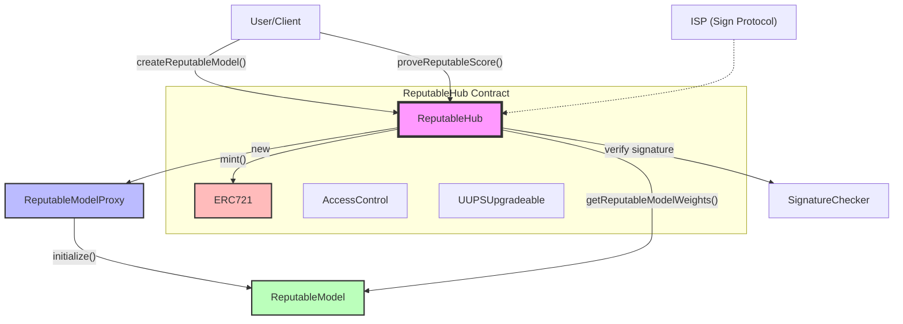

# Reputable Smart Contracts

<div align="center" style="display: flex; justify-content: center; align-items: center; flex-wrap: nowrap; overflow-x: auto;">
    
    
    
</div>

The Reputable protocol is an innovative blockchain-based system designed to create, manage,verify and compute custom reputation models. It leverages the power of smart contracts to provide a trustless and transparent framework for reputation assessment.

Key features and goals of the Reputable protocol include:

- **Custom Reputable Models:** Users can create and deploy personalized reputation models tailored to specific use cases or communities. Each model is represented as a unique ERC721 token, providing ownership and transferability.

- **Trustless and Verifiable Computation:** The protocol ensures the integrity of reputation calculations through a robust verification process:

  - The smart contract verifies **SignProtocol** attestations to confirm the authenticity of submitted
  - Once verified, the contract computes the reputation score based on the attestation data and the custom model parameters.

- **Decentralized Reputation Management:** By utilizing blockchain technology, the Reputable protocol offers a decentralized approach to reputation systems, reducing reliance on centralized authorities.

- **Interoperability:** As ERC721 tokens, Reputable models can easily integrate with other blockchain ecosystems and DeFi applications.

- **Transparency and Auditability:** All reputation model parameters and score calculations are recorded on-chain, allowing for full transparency and auditability.

We have chosen to deploy the Reputable protocol on the **Unichain Sepolia testnet**. This decision aligns perfectly with our use case and opens up numerous possibilities for DeFi applications.

The Reputable Smart Contracts form the core of this protocol, implementing the logic for model creation, attestation verification, and score computation in a secure and efficient manner.

## Project Setup

To set up the project, follow these steps:

1. Install dependencies:

```
npm install
```

## Available Commands

The project includes several npm scripts to help with development, testing, and deployment. Here's a breakdown of the available commands:

Starts a local Hardhat node, forking the unichain sepolia testnet for testing purposes.

```
npm run start-fork
```

Compiles the Solidity smart contracts.

```
npm run compile
```

Runs the deployment script to deploy the smart contracts.

```
npm run deploy
```

Runs the test suite for the smart contracts.

```
npm run test
```

Runs the test suite and generates a coverage report.

```
npm run test:coverage
```

Lints the Solidity contracts and JavaScript files.

```
npm run lint
```

Formats the JavaScript and Solidity files using Prettier.

```
npm run format
```

Checks if all files are correctly formatted without making changes.

```
npm run check-format
```

Removes generated files and cleans the project directory.

```
npm run clean
```

## Development Workflow

1. Make changes to the smart contracts in the `contracts/` directory.
2. Write tests for your changes in the `test/` directory.
3. Run `npm run compile` to compile your contracts.
4. Run `npm run test` to ensure all tests pass.
5. Use `npm run lint` and `npm run format` to maintain code quality.
6. When ready to deploy, use `npm run start-fork` and after `npm run deploy -- --network local-fork` to deploy on a local unichain sepolia fork.

## Technical Schema



## License

This project is licensed under the MIT License.
